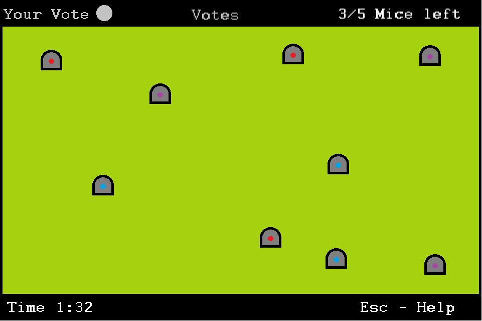
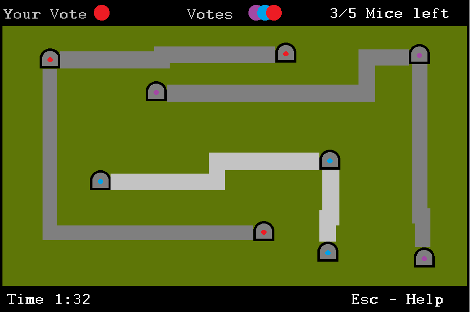
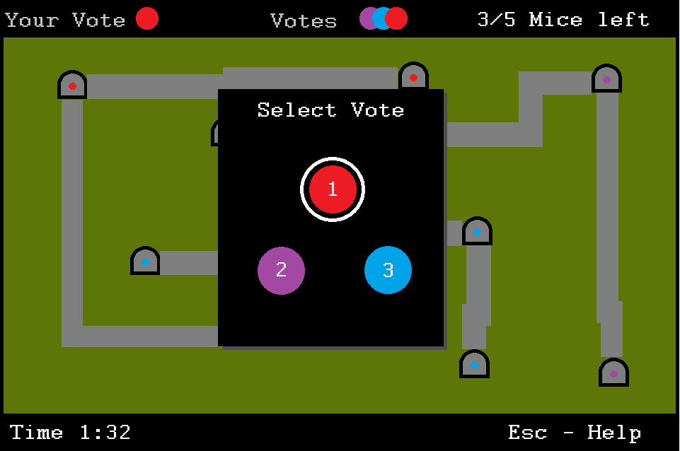
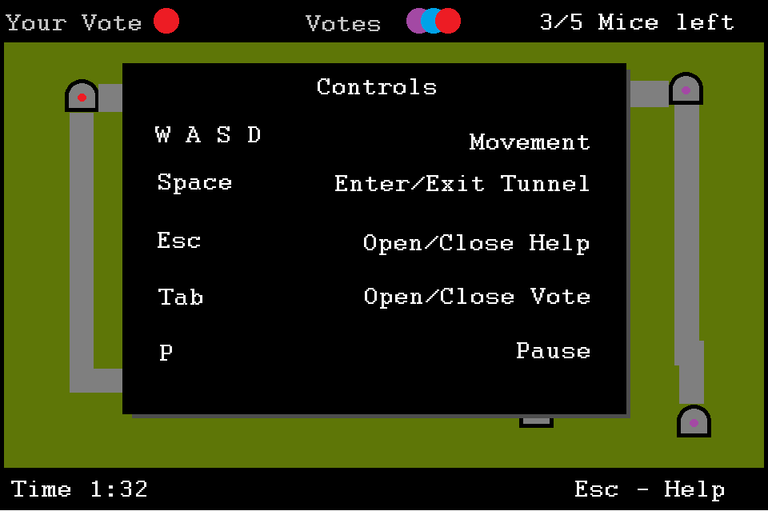
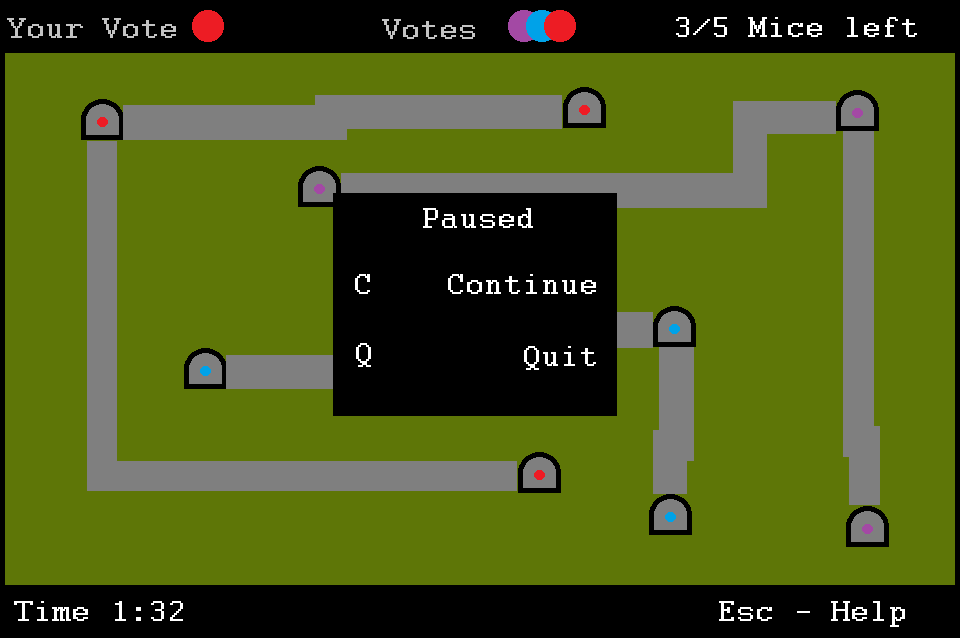

# FOOP 2024S

## Implementations
The game is implemented three times in different Object Oriented Programming Languages.

- JavaScript
- SmallTalk
- Eiffel

## Group "P"
This project is worked on by the following team members:

- Stephan Stöger
- Raffael Svoboda
- Matthias Preymann
- Philipp Vanek
  
## Mockups

### Playing field

### Various menu screens

## Game Description
Taken from the exercise sheet written by Prof. Puntigam:

A rectangular playing field contains several subways (not con-
nected with each other) where mice are safe from being caught by
cats staying at the surface. Each subway has several exits to the
surface. Mice in subways can move without being seen by cats, and
cats can move on the surface without being seen by mice in sub-
ways. A mouse in a subway sees other mice in the same subway, but
not mice in other subways. Cats and mice on the surface see each
other, and cats try to catch mice that show up at the surface. Each
mouse knows all subways and their exits, but cats see only exits and
do not know how they are connected by subways. When a mouse
safely enters a subway, it informs other mice in this subway about
positions of cats at the time of entering. Initially, mice are located
in arbitrary (when possible different) subways and cats somewhere
on the surface. All mice want to meet in one subway, but it is not
predetermined in which one. Mice in the same subway can coordi-
nate themselves by voting for a specific subway to meet, seeing the
votes of other mice in the same subway and adapting their votes un-
til there is an agreement. But, mice in one subway cannot see votes
of mice in other subways. To distribute information and to meet,
some mice must move to other subways, but thereby they have to
cover a distance at the surface. Every stay at the surface is risky for
mice, the longer the more dangerous. A game ends when all surviv-
ing mice are in the same subway (in this case the surviving mice are
the winners) or after a predefined amount of time (no mouse wins
because the aim of meeting all others was not achieved).

Each player (real person) controls a mouse. Cats that try to
catch mice are controlled by computer algorithms (not necessarily
each cat by the same algorithm). To make the game more inter-
esting, there can also be mice controlled by computer algorithms,
but that is not absolutely necessary. Each player uses his or her own
computer connected to a network. It must be possible that at least 4
players on 4 different computers participate in the same game. The
communication between the computers shall be efficient enough to
avoid noticeable delays for the largest possible playing field (with
reasonable resolution on the available screen size).

## License
This project is licensed under the MIT license.
